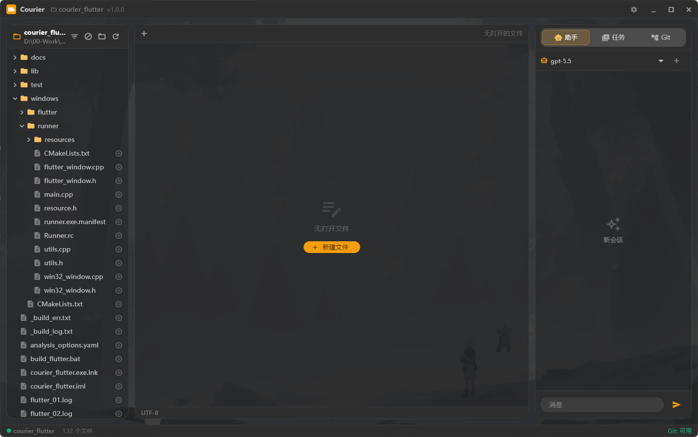
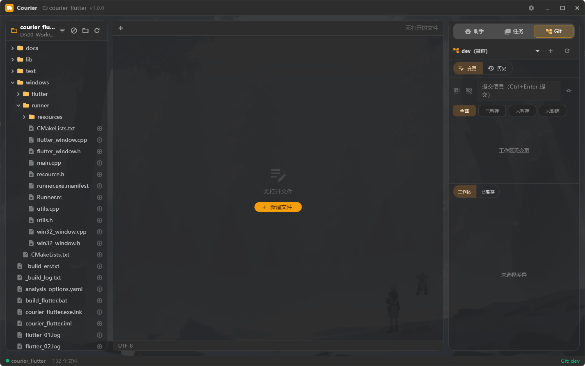
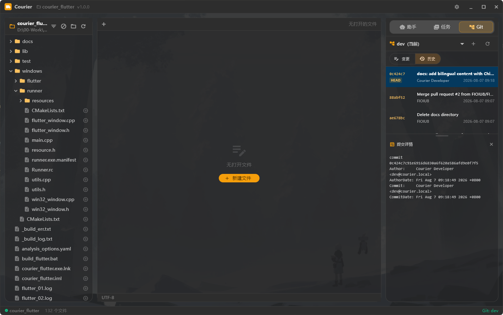
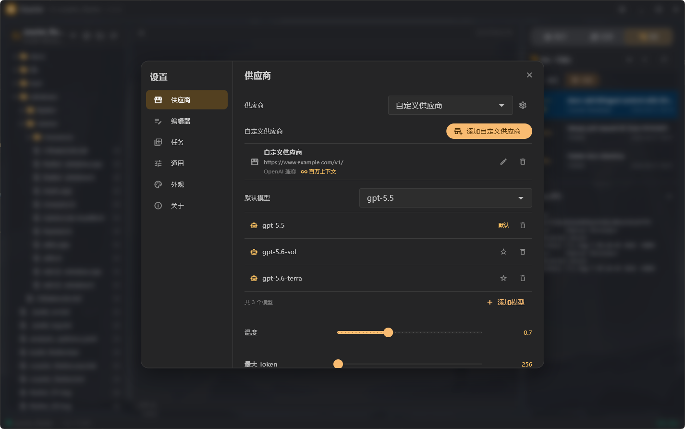
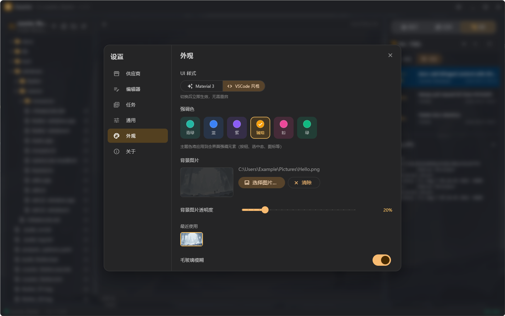

# Courier

[中文](#courier-中文) | [English](#courier-english)

---

# Courier

> **开发中** — Courier 目前处于活跃开发阶段，功能持续迭代，尚未发布正式版本。

Courier 是一个面向本地工作区的 Windows 桌面 AI 代码编辑器。应用使用 Flutter 和 Dart 实现文件编辑、AI 对话、任务队列与 Git 操作，不依赖 Go 运行时、Go 服务或外部动态库。

## 功能

- 工作区文件树：异步扫描、分类过滤、排除规则、隐藏文件设置和文件拖放。
- 安全文件操作：工作区边界校验、符号链接保护、UTF-8 与大小检查、原子保存和外部修改冲突检测。
- 多标签编辑器：新建、打开、另存为、自动保存、未保存关闭确认和删除影响保护。
- AI 助手：OpenAI 与 Anthropic Provider、系统凭据存储、模型列表、流式响应、取消生成和 Markdown 渲染。AI 对话历史持久化尚未实现。
- 本地任务队列：工作区级持久化、并发执行、进度、日志、结果、取消与受限重试。
- Git 面板：状态、按文件差异、暂存、取消暂存、暂存全部、取消暂存全部、提交、分支列表、安全切换与创建分支。
- 外观定制：Material 3 毛玻璃与 VSCode 深色两种主题风格、自定义强调色、背景图片支持、各面板独立透明度控制。
- 工作区配置：偏好、任务、日志和隔离区统一保存在 `.Courier/`。

### 截图

**编辑器与 AI 助手**

**Git 差异视图**

**Git 暂存与文件列表**

**AI Provider 设置**

**外观主题设置**

## 平台

| 平台 | 状态 |
| --- | --- |
| Windows Desktop | 当前发布目标 |
| macOS Desktop | 尚未纳入发布流水线 |
| Linux Desktop | 尚未纳入发布流水线 |

## 安装

从 [GitHub Releases](https://github.com/FIOIU8/Courier/releases) 下载最新的 Windows 压缩包，完整解压后运行 `courier_flutter.exe`。

发布包中的可执行文件、Flutter 引擎和插件库必须保持在同一目录结构中。应用运行不需要额外的 Go 产物。

## 本地开发

环境要求：

- Flutter 3.44.0 或更高稳定版本。
- Dart 3.12.0 或更高版本。
- Windows 10 或更高版本。
- Visual Studio 的 Desktop development with C++ 工作负载。
- Git CLI，用于应用内 Git 面板和仓库测试。

安装依赖并执行质量检查：

~~~powershell
flutter pub get
flutter analyze
flutter test
~~~

运行桌面应用：

~~~powershell
flutter run -d windows
~~~

构建 Windows Release：

~~~powershell
flutter build windows --release
~~~

也可以使用仓库内的构建脚本执行完整流水线：

~~~powershell
.\build_flutter.bat
~~~

需要重新生成 Flutter 构建产物时使用：

~~~powershell
.\build_flutter.bat --clean
~~~

## 配置

全局非敏感设置使用平台偏好存储。以下环境变量可覆盖对应的启动设置：

| 变量 | 用途 |
| --- | --- |
| `COURIER_AI_PROVIDER_ID` | 选择受支持的 AI Provider |
| `COURIER_AI_MODEL_ID` | 选择 AI 模型 |
| `COURIER_TASK_MAX_CONCURRENCY` | 设置任务最大并发数 |
| `COURIER_LOG_LEVEL` | 设置日志级别 |

AI API Key 只能通过应用设置页写入操作系统凭据存储，不会写入工作区配置、SharedPreferences、日志或仓库文件。

每个已打开工作区会创建以下本地状态：

~~~text
.Courier/
├── prefs.json
├── logs/
├── sessions/
├── tasks/
└── trash/
~~~

`.Courier/` 已加入 Git 忽略规则。删除文件或目录时，内容先移动到 `.Courier/trash/`，不会直接递归删除。

## 自动发布

`.github/workflows/auto-release.yml` 每 6 小时检查默认分支，也支持手动触发。只有相对最新 Tag 存在新提交时，工作流才会执行分析、测试、Windows Release 构建、压缩和 GitHub Release 发布。

版本规则：

- 仓库没有 Tag 时使用 `v0.1.0`。
- 最新 Tag 符合 SemVer 时递增 patch 版本。
- 最新 Tag 不符合 SemVer 时使用包含 UTC 时间和提交短哈希的预发布版本。

Release Notes 包含"更新内容"和"贡献列表"。贡献列表从完整 Git 历史生成并去重。工作流会在发布前检查提交信息中疑似泄露的凭据格式。

## 安全边界

- 文件创建、读取、保存、重命名和隔离操作必须位于当前工作区。
- 工作区根目录和 `.Courier/` 内部目录不接受符号链接替换。
- 编辑器只打开大小受限的 UTF-8 文本，检测到二进制内容时拒绝加载。
- 保存采用同目录临时文件替换，并通过文件指纹阻止静默覆盖外部修改。
- AI 请求设置连接与响应超时、有限重试、输出大小上限和取消标识。
- Git 命令不通过 shell 执行，工作目录固定为当前仓库根目录。
- 日志会脱敏常见凭据格式，且不记录完整用户文件内容。

## 项目结构

| 路径 | 职责 |
| --- | --- |
| `lib/services/` | 文件安全、设置、AI、任务、Git、日志和应用服务 |
| `lib/widgets/` | 文件树、编辑器、AI、任务、Git 与设置界面 |
| `test/` | 单元测试、Widget 测试和安全回归测试 |
| `windows/` | Flutter Windows Runner |
| `docs/` | 系统总结与升级计划 |

## 贡献

提交前必须运行 `flutter analyze`、`flutter test`，并在涉及 Windows 插件或发布链路时运行 `flutter build windows --release`。

提交信息采用英文 Conventional Commits，例如 `feat: add workspace isolation recovery` 或 `fix: preserve active request ownership`。Pull Request 应说明行为变化、验证命令和用户数据风险。

## 许可证

本项目采用 [GNU General Public License v3.0](LICENSE)。

---

# Courier

> **Under Development** — Courier is currently in active development, with features being iterated continuously. No stable release has been published yet.

Courier is a Windows desktop AI code editor designed for local workspaces. Built entirely with Flutter and Dart, it provides file editing, AI conversations, task queues, and Git operations — with no dependency on Go runtime, Go services, or external native libraries.

## Features

- **Workspace file tree**: Async scanning, categorization filters, exclude rules, hidden-file toggle, and file drag-and-drop.
- **Safe file operations**: Workspace boundary validation, symlink protection, UTF-8 and size checks, atomic saves, and external modification conflict detection.
- **Multi-tab editor**: New, open, save-as, auto-save, unsaved-close confirmation, and delete-impact protection.
- **AI assistant**: OpenAI and Anthropic providers, OS credential storage, model listing, streaming responses, generation cancellation, and Markdown rendering. AI conversation history persistence is not yet implemented.
- **Local task queue**: Workspace-scoped persistence, concurrent execution, progress, logs, results, cancellation, and limited retry.
- **Git panel**: Status, per-file diff, stage, unstage, stage-all, unstage-all, commit, branch list, safe branch switching, and branch creation.
- **Appearance customization**: Material 3 glassmorphism and VSCode dark flat themes, custom accent color, background image support, per-panel opacity controls.
- **Workspace configuration**: Preferences, tasks, logs, and trash are unified under `.Courier/`.

### Screenshots

**Editor & AI Assistant**

**Git Diff View**

**Git Stage & File List**

**AI Provider Settings**

**Appearance & Theme Settings**

## Platforms

| Platform | Status |
| --- | --- |
| Windows Desktop | Current release target |
| macOS Desktop | Not yet in release pipeline |
| Linux Desktop | Not yet in release pipeline |

## Installation

Download the latest Windows archive from [GitHub Releases](https://github.com/FIOIU8/Courier/releases), extract it fully, and run `courier_flutter.exe`.

The executable, Flutter engine, and plugin libraries in the release package must remain in the same directory structure. No additional Go artifacts are required to run the app.

## Local Development

Requirements:

- Flutter 3.44.0 or later stable.
- Dart 3.12.0 or later.
- Windows 10 or later.
- Visual Studio with the "Desktop development with C++" workload.
- Git CLI for the in-app Git panel and repository testing.

Install dependencies and run quality checks:

~~~powershell
flutter pub get
flutter analyze
flutter test
~~~

Run the desktop app:

~~~powershell
flutter run -d windows
~~~

Build a Windows Release:

~~~powershell
flutter build windows --release
~~~

You can also use the repo's build script for the full pipeline:

~~~powershell
.\build_flutter.bat
~~~

Use this to regenerate Flutter build artifacts:

~~~powershell
.\build_flutter.bat --clean
~~~

## Configuration

Global non-sensitive settings use platform preference storage. The following environment variables override startup settings:

| Variable | Purpose |
| --- | --- |
| `COURIER_AI_PROVIDER_ID` | Select the AI provider |
| `COURIER_AI_MODEL_ID` | Select the AI model |
| `COURIER_TASK_MAX_CONCURRENCY` | Set max task concurrency |
| `COURIER_LOG_LEVEL` | Set log level |

AI API keys can only be written to the OS credential store via the app's settings page. They are never written to workspace config, SharedPreferences, logs, or repository files.

Each opened workspace creates the following local state:

~~~text
.Courier/
├── prefs.json
├── logs/
├── sessions/
├── tasks/
└── trash/
~~~

`.Courier/` is in the Git ignore rules. When files or directories are deleted, their content is moved to `.Courier/trash/` — never recursively deleted directly.

## Auto Release

`.github/workflows/auto-release.yml` checks the default branch every 6 hours, and also supports manual triggering. The workflow runs analysis, tests, Windows Release build, compression, and GitHub Release publishing only when new commits exist relative to the latest tag.

Versioning rules:

- When the repo has no tag, use `v0.1.0`.
- When the latest tag is valid SemVer, increment the patch version.
- When the latest tag is not valid SemVer, use a prerelease version containing UTC time and commit short hash.

Release Notes include "What's Changed" and a "Contributors" list. The contributor list is generated from the full Git history and deduplicated. The workflow scans commit messages for suspected credential leaks before publishing.

## Security Boundaries

- File creation, read, save, rename, and quarantine operations must stay within the current workspace.
- The workspace root and `.Courier/` internal directories reject symlink replacement.
- The editor only opens size-limited UTF-8 text; binary content is rejected on load.
- Saves use same-directory temp-file replacement, and file fingerprints prevent silent overwrites of external modifications.
- AI requests enforce connection and response timeouts, limited retries, output size limits, and cancellation tokens.
- Git commands are never run through a shell; the working directory is fixed to the current repo root.
- Logs redact common credential formats and never record full user file contents.

## Project Structure

| Path | Responsibility |
| --- | --- |
| `lib/services/` | File safety, settings, AI, tasks, Git, logging, and app services |
| `lib/widgets/` | File tree, editor, AI, tasks, Git, and settings UI |
| `test/` | Unit tests, widget tests, and security regression tests |
| `windows/` | Flutter Windows Runner |
| `docs/` | System summaries and upgrade plans |

## Contributing

Before committing, you must run `flutter analyze`, `flutter test`, and — when touching Windows plugins or the release pipeline — `flutter build windows --release`.

Commit messages follow English Conventional Commits, e.g. `feat: add workspace isolation recovery` or `fix: preserve active request ownership`. Pull requests should describe behavioral changes, verification commands, and user data risks.

## License

This project is licensed under the [GNU General Public License v3.0](LICENSE).
