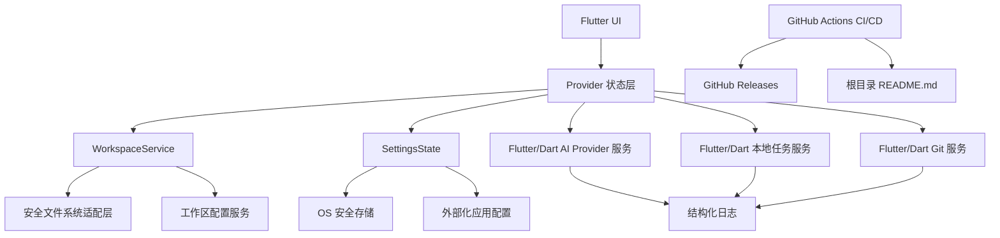
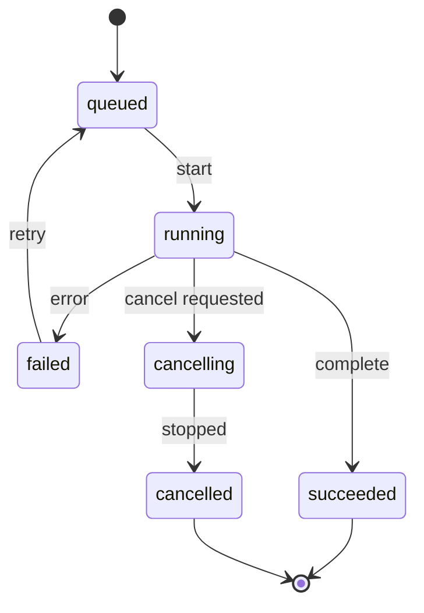
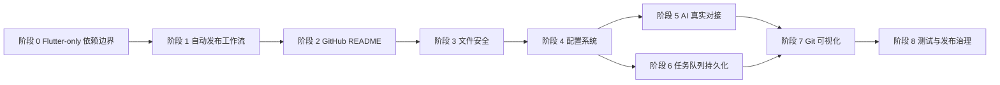

# Courier Flutter 升级计划

## 1. 文档信息

| 项目 | 内容 |
| --- | --- |
| 文档路径 | `./docs/升级计划.md` |
| 依据文档 | `./docs/现有系统总结.md`、当前用户修正说明、项目根目录 `pubspec.yaml`、当前源码结构 |
| 适用项目 | `courier_flutter` |
| 项目定位 | Flutter 桌面端应用，不以 Go 后端或 Go 动态库作为运行依赖 |
| 目标版本方向 | 从当前 Flutter 桌面原型升级为可稳定构建、可安全编辑、可自动发布、适合 GitHub 开源展示的桌面应用 |
| 执行约束 | 本计划只描述需要更新的模块、配置文件、工作流文件和文档文件，不直接修改任何源代码、配置、脚本或根目录 README |

## 2. 关键修正说明

此前计划中将项目描述为依赖 Go 动态库和 FFI 核心能力。根据最新项目约束，本项目应按 **Flutter-only** 方向规划：

1. 项目运行时不应依赖 Go 服务、Go 动态库或外部 Go 构建产物。
2. 源码中如存在 `courier_core`、`dart:ffi`、`courier_core.dll` 等历史迁移残留，应作为后续重构清理对象处理。
3. AI、任务队列、Git、文件系统、设置管理等能力应优先由 Dart/Flutter 层或成熟 Flutter/Dart 插件实现。
4. CI/CD 发布链路只需要验证 Flutter 项目本身，不应包含 Go 构建、Go 产物复制或 Go 版本校验步骤。

## 3. 当前现状与目标差距分析

### 3.1 当前现状

项目当前具备以下基础能力：

1. Flutter 桌面端项目结构完整，`pubspec.yaml` 中声明 Flutter SDK、Provider、go\_router、window\_manager、file\_picker、shared\_preferences 等依赖。
2. 已具备 Windows 桌面 UI 基础，包括主界面、工作区文件树、编辑器、AI 助手、任务队列、设置页等模块雏形。
3. `WorkspaceService` 已承担工作区选择、文件树扫描、多标签编辑、文件读写、排除列表和分类过滤等职责。
4. 根目录 `README.md` 仍为 Flutter 默认模板，不适合作为 GitHub 项目首页。
5. 当前仓库尚未发现 `.github/workflows` 目录，缺少 GitHub Actions 自动构建与自动发布工作流。
6. 源码中存在 `courier_core` 命名和 FFI 相关历史实现，应按 Flutter-only 目标进行替换、隔离或删除规划。

### 3.2 目标状态

升级后的项目应达到以下状态：

1. Windows Flutter Release 可稳定构建，后续可按需要扩展 Linux/macOS 构建。
2. 项目不依赖 Go 运行时、Go 动态库或开发机绝对路径。
3. 工作区文件操作满足生产级安全要求：路径边界校验、原子写入、删除保护、软链接策略、异常恢复。
4. AI Provider 配置、模型选择、密钥存储、流式输出具备 Flutter/Dart 侧可落地设计。
5. 任务队列从内存占位实现升级为可持久化、可取消、可重试、可观测的 Flutter 本地任务模型。
6. `.Courier` 工作区配置落地，支持工作区级偏好、文件过滤、任务与会话元数据。
7. Git 功能采用 Dart 进程调用或成熟插件封装，并提供可视化面板和危险操作确认。
8. 根目录新增 GitHub Actions 自动发布工作流：定时检测新提交，有更新时自动构建并发布新版本。
9. Release 更新日志必须包含“更新内容”和“贡献列表”，贡献列表展示从仓库初始提交至当前提交的所有贡献者。
10. 根目录 `README.md` 应替换为适合 GitHub 展示的项目介绍、安装、构建、发布说明文档。

### 3.3 差距矩阵

| 能力域 | 当前状态 | 目标状态 | 优先级 |
| --- | --- | --- | ---: |
| Flutter 构建发布 | 项目可作为 Flutter 桌面项目维护，但缺少 CI 发布闭环 | GitHub Actions 自动分析、测试、构建、发版 | P0 |
| Go/FFI 残留 | 源码中存在 `courier_core`、FFI、DLL 路径等历史残留 | Flutter-only，移除 Go 运行依赖和 DLL 加载路径 | P0 |
| GitHub Release | 尚未配置自动发布工作流 | 定时检测新提交并自动生成版本、Release、更新日志和贡献列表 | P0 |
| GitHub README | 仍为 Flutter 默认模板 | 介绍项目定位、功能、安装、开发、发布、贡献方式 | P0 |
| 文件安全 | 可读写、重命名、递归删除能力需要加固 | 工作区边界校验、原子保存、安全删除、软链接保护 | P0 |
| AI 能力 | 面板与服务雏形存在，真实 Provider 能力需重构 | Flutter/Dart Provider 抽象、流式输出、取消生成、Markdown 渲染 | P1 |
| 密钥管理 | 未形成生产级方案 | OS 安全存储或外部密钥引用，密钥可轮换、无硬编码 | P1 |
| 任务队列 | 内存任务与占位控制 | 持久化任务、状态机、取消、重试、日志、进度 | P1 |
| Git 面板 | 需要从服务能力升级为 UI 能力 | 可视化 staging、diff、提交、分支切换与安全确认 | P2 |
| 设置系统 | 部分设置集中，Provider/Model 等仍需统一 | 统一 SettingsState 和工作区配置分层 | P2 |
| 测试 | 需要补充安全与构建测试 | 单元、Widget、集成、构建、文件安全、CI 矩阵 | P2 |
| 跨平台 | 当前聚焦 Windows | 为 macOS/Linux 预留发布策略 | P3 |

## 4. 总体升级架构



### 4.1 设计原则

1. **Flutter-only 优先**：新增能力优先通过 Dart/Flutter 实现，不引入 Go 运行时链路。
2. **先解决交付阻断，再扩展功能**：优先完成自动发布、README、构建稳定性、文件安全和历史 FFI 残留清理。
3. **核心能力外部化配置**：AI Provider、日志级别、任务并发、发布策略等不得硬编码敏感信息。
4. **文件操作安全优先**：任何创建、保存、重命名、删除前必须通过工作区边界校验。
5. **UI 线程不执行耗时任务**：真实 AI、Git diff、任务执行、目录扫描应异步化或隔离到后台执行上下文。
6. **可观测与可回滚**：任务执行、文件写入、Git 操作、自动发布都需要日志、状态、错误码与用户可理解反馈。
7. **供应链安全**：GitHub Actions 中的第三方 Action 在生产落地时应固定到可信版本或提交 SHA，并限制最小权限。

## 5. 分阶段实施计划

## 5.1 阶段 0：Flutter-only 依赖边界与构建发布基础

### 目标

明确项目不依赖 Go，清理或替换 Go/FFI 历史残留，并建立可在干净 CI 环境中执行的 Flutter 构建基础。

### 任务清单

| 任务编号 | 任务 | 涉及模块 | 预期成果 |
| --- | --- | --- | --- |
| P0-01 | 梳理 `courier_core`、`dart:ffi`、`courier_core.dll` 相关调用点 | `lib/services/`、相关 widgets | 输出 Flutter-only 替换清单 |
| P0-02 | 将历史 FFI 服务抽象替换为 Dart 服务接口 | AI、任务、Git、加密/密钥相关服务 | UI 不再直接依赖 DLL 加载状态 |
| P0-03 | 移除开发机绝对路径依赖规划 | FFI 残留服务、测试、构建说明 | Release 构建不需要外部 DLL 路径 |
| P0-04 | 建立 Flutter 分析与测试基线 | `flutter analyze`、`flutter test` | CI 可重复验证项目质量 |
| P0-05 | 明确 Windows Release 构建命令和产物目录 | GitHub Actions、发布文档 | 自动发布工作流可压缩 Windows 构建产物 |

### Flutter-only 替换原则

| 历史能力 | Flutter-only 目标实现 | 说明 |
| --- | --- | --- |
| FFI 核心版本检查 | 应用版本来自 `pubspec.yaml` 与构建元数据 | 不再需要动态库版本 |
| AI 会话 | Dart HTTP/SSE 客户端封装 Provider | 密钥通过 OS 安全存储或 CI Secret 引用，不写入仓库 |
| 任务队列 | Dart 本地状态机与持久化文件 | 可使用 `.Courier/tasks` 保存任务索引和日志 |
| Git 操作 | Dart `Process` 调用 Git CLI 或成熟 Git 插件封装 | 必须限定工作目录为当前工作区根目录 |
| 加密能力 | Dart 加密库与 OS 安全存储组合 | 密钥不得明文持久化 |

### 验收标准

1. 项目文档和发布链路不再要求 Go 构建、Go 动态库或 DLL 路径。
2. `flutter analyze` 通过。
3. `flutter test` 通过。
4. Windows Release 构建通过。
5. 启动应用不需要外部 Go 产物。

### 风险与回滚方案

| 风险 | 回滚方案 |
| --- | --- |
| 一次性删除 FFI 残留导致 UI 大面积不可用 | 先增加 Dart 服务接口适配层，再逐步替换具体实现 |
| Git/AI/任务能力短期缺失 | 保留 UI 降级提示，功能按阶段恢复 |
| 第三方 Dart 插件能力不足 | 先使用受控的 Dart `Process` 或 HTTP 客户端实现，再评估插件替换 |

## 5.2 阶段 1：GitHub Actions 自动发布工作流

### 目标

在项目根目录规划新增 `.github/workflows/auto-release.yml`。该工作流应定时检测默认分支是否存在相对最新 Release Tag 的新提交；如果存在新提交，则自动构建 Flutter Windows Release，创建新版本，并将更新日志写入 GitHub Releases。

### 工作流触发策略

| 触发方式 | 配置 | 用途 |
| --- | --- | --- |
| 定时触发 | `schedule`，建议每 6 小时执行一次 | 自动检测新提交并发布版本 |
| 手动触发 | `workflow_dispatch` | 维护者需要立即发布时手动执行 |
| 权限范围 | `contents: write`、`actions: read` | 创建 Tag、上传 Release、读取工作流上下文 |

### 版本生成策略

| 场景 | 行为 |
| --- | --- |
| 仓库不存在任何 Tag | 创建初始版本 `v0.1.0` |
| 最新 Tag 到当前 HEAD 没有新提交 | 工作流正常退出，不创建 Release |
| 最新 Tag 到当前 HEAD 存在新提交 | 读取最新 SemVer Tag，递增 patch 版本 |
| 最新 Tag 不符合 `v<major>.<minor>.<patch>` | 使用基于日期和提交短哈希的安全版本号 |

### Release 更新日志规则

Release Body 必须包含以下结构：

```markdown
## 更新内容

- <提交标题> (`<短提交哈希>`)

## 贡献列表

- <贡献者名称> <<贡献者邮箱>>
```

约束：

1. “更新内容”只列出最新 Tag 之后到当前 HEAD 的提交。
2. “贡献列表”必须来自 `git log --format`，范围为仓库初始提交到当前 HEAD。
3. 贡献者列表需去重并稳定排序。
4. Release 日志不得包含密钥、令牌或 CI Secret。
5. 如果提交信息中疑似包含敏感内容，应在后续实施中加入脱敏检查，阻止发布或替换敏感片段。

### 计划新增文件：`.github/workflows/auto-release.yml`

> 本节是未来需要写入根目录的工作流文件内容草案。本计划不直接创建该文件。

```yaml
name: Auto Release

on:
  schedule:
    - cron: '0 */6 * * *'
  workflow_dispatch:

permissions:
  contents: write
  actions: read

concurrency:
  group: auto-release-${{ github.ref }}
  cancel-in-progress: false

jobs:
  auto-release:
    name: Build and publish release when new commits exist
    runs-on: windows-latest

    steps:
      - name: Checkout repository
        uses: actions/checkout@v4
        with:
          fetch-depth: 0

      - name: Set up Flutter
        uses: subosito/flutter-action@v2
        with:
          channel: stable
          cache: true

      - name: Enable Windows desktop
        shell: pwsh
        run: flutter config --enable-windows-desktop

      - name: Resolve Flutter dependencies
        shell: pwsh
        run: flutter pub get

      - name: Analyze Flutter project
        shell: pwsh
        run: flutter analyze

      - name: Run Flutter tests
        shell: pwsh
        run: flutter test

      - name: Calculate release metadata
        id: release_meta
        shell: pwsh
        run: |
          $ErrorActionPreference = 'Stop'

          $latestTag = git describe --tags --abbrev=0 2>$null
          if (-not $latestTag) {
            $hasChanges = 'true'
            $newTag = 'v0.1.0'
            $commitRange = 'HEAD'
          } else {
            $commitCount = [int](git rev-list "$latestTag..HEAD" --count)
            if ($commitCount -le 0) {
              "should_release=false" | Out-File -FilePath $env:GITHUB_OUTPUT -Append
              exit 0
            }

            $hasChanges = 'true'
            if ($latestTag -match '^v(\d+)\.(\d+)\.(\d+)$') {
              $major = [int]$Matches[1]
              $minor = [int]$Matches[2]
              $patch = [int]$Matches[3] + 1
              $newTag = "v$major.$minor.$patch"
            } else {
              $datePart = Get-Date -Format 'yyyyMMddHHmmss'
              $shortSha = git rev-parse --short HEAD
              $newTag = "v0.0.0-$datePart-$shortSha"
            }
            $commitRange = "$latestTag..HEAD"
          }

          "should_release=$hasChanges" | Out-File -FilePath $env:GITHUB_OUTPUT -Append
          "new_tag=$newTag" | Out-File -FilePath $env:GITHUB_OUTPUT -Append
          "commit_range=$commitRange" | Out-File -FilePath $env:GITHUB_OUTPUT -Append

      - name: Build Windows release
        if: steps.release_meta.outputs.should_release == 'true'
        shell: pwsh
        run: flutter build windows --release

      - name: Package Windows artifact
        if: steps.release_meta.outputs.should_release == 'true'
        shell: pwsh
        run: |
          $ErrorActionPreference = 'Stop'
          $tag = '${{ steps.release_meta.outputs.new_tag }}'
          $sourceDir = 'build/windows/x64/runner/Release'
          $artifactDir = 'dist'
          $artifactPath = "$artifactDir/courier_flutter_windows_$tag.zip"
          New-Item -ItemType Directory -Force -Path $artifactDir | Out-Null
          Compress-Archive -Path "$sourceDir/*" -DestinationPath $artifactPath -Force

      - name: Generate release notes
        if: steps.release_meta.outputs.should_release == 'true'
        shell: pwsh
        run: |
          $ErrorActionPreference = 'Stop'
          $commitRange = '${{ steps.release_meta.outputs.commit_range }}'
          $notesPath = 'release-notes.md'

          "## 更新内容" | Out-File -FilePath $notesPath -Encoding utf8
          "" | Out-File -FilePath $notesPath -Encoding utf8 -Append
          git log $commitRange --pretty=format:'- %s (`%h`)' | Out-File -FilePath $notesPath -Encoding utf8 -Append
          "" | Out-File -FilePath $notesPath -Encoding utf8 -Append
          "" | Out-File -FilePath $notesPath -Encoding utf8 -Append
          "## 贡献列表" | Out-File -FilePath $notesPath -Encoding utf8 -Append
          "" | Out-File -FilePath $notesPath -Encoding utf8 -Append
          git log --format='- %aN <%aE>' | Sort-Object -Unique | Out-File -FilePath $notesPath -Encoding utf8 -Append

      - name: Create and push tag
        if: steps.release_meta.outputs.should_release == 'true'
        shell: pwsh
        run: |
          $ErrorActionPreference = 'Stop'
          $tag = '${{ steps.release_meta.outputs.new_tag }}'
          git config user.name 'github-actions[bot]'
          git config user.email 'github-actions[bot]@users.noreply.github.com'
          git tag $tag
          git push origin $tag

      - name: Publish GitHub Release
        if: steps.release_meta.outputs.should_release == 'true'
        uses: softprops/action-gh-release@v2
        with:
          tag_name: ${{ steps.release_meta.outputs.new_tag }}
          name: Courier Flutter ${{ steps.release_meta.outputs.new_tag }}
          body_path: release-notes.md
          files: dist/*.zip
```

### 生产落地注意事项

1. 上述草案中第三方 Action 应在正式落地时固定到可信提交 SHA，降低供应链风险。
2. 如果仓库开启分支保护，需要确认 `GITHUB_TOKEN` 是否允许推送 Tag；如不允许，应改为使用受保护的发布流程或维护者手动授权的发布令牌引用。
3. 发布工作流不应读取或输出任何业务密钥。
4. 自动发布只应在默认分支运行；如后续支持预发布，应为开发分支单独设计 prerelease 工作流。
5. Release 产物应在发布前通过 `flutter analyze`、`flutter test`、`flutter build windows --release`。

### 验收标准

1. `.github/workflows/auto-release.yml` 合入默认分支后，GitHub Actions 页面可以看到定时工作流。
2. 没有新提交时，工作流退出且不创建新 Tag。
3. 有新提交时，工作流创建新 SemVer Tag。
4. GitHub Release 包含 Windows 压缩产物。
5. Release Body 顶部包含“更新内容”，底部包含“贡献列表”。
6. 贡献列表展示从仓库初始提交到当前 HEAD 的全部贡献者，且去重。

## 5.3 阶段 2：根目录 GitHub README.md

### 目标

将根目录 `README.md` 从 Flutter 默认模板更新为面向 GitHub 访问者的项目说明文件，介绍项目定位、功能、安装方式、开发方式、自动发布机制和贡献方式。

### README 必须覆盖的内容

| 章节 | 内容要求 |
| --- | --- |
| 项目标题 | 使用 `Courier Flutter` 或最终产品名 |
| 项目简介 | 说明这是 Flutter 桌面端 AI 代码编辑器，不依赖 Go |
| 功能特性 | 工作区文件树、Markdown/代码编辑、AI 助手、任务队列、Git 面板规划、设置中心 |
| 平台支持 | 明确当前优先支持 Windows Desktop，后续规划 macOS/Linux |
| 安装方式 | 引导用户从 GitHub Releases 下载发布产物 |
| 本地开发 | Flutter SDK 版本要求、依赖安装、分析、测试、运行、构建命令 |
| 自动发布 | 说明 `.github/workflows/auto-release.yml` 会定时检测新提交并发布 Release |
| 安全说明 | 密钥不写入仓库，AI API Key 通过 OS 安全存储或外部密钥引用保存 |
| 贡献方式 | Issue、Pull Request、提交信息要求、测试要求 |
| 许可证 | 指向仓库许可证文件；如尚未确定，应列为待决策项 |

### 计划更新文件：`README.md`

> 本节是未来需要写入根目录 `README.md` 的内容草案。本计划不直接修改根目录文件。

```markdown
# Courier Flutter

Courier Flutter 是一个基于 Flutter 的桌面端 AI 代码编辑器，目标是在本地工作区内提供文件浏览、编辑、AI 辅助、任务管理和 Git 可视化能力。

本项目按 Flutter-only 方向维护，不要求 Go 运行时、Go 服务或 Go 动态库作为应用运行依赖。

## 功能特性

- 工作区文件树：浏览项目目录、过滤常见构建产物和依赖目录。
- 多标签编辑：打开、编辑和保存工作区内文件。
- AI 助手：规划支持多 Provider、模型选择、流式输出和 Markdown 渲染。
- 任务队列：规划支持任务持久化、取消、重试、进度和日志。
- Git 面板：规划支持状态查看、差异查看、暂存、提交和分支切换。
- 设置中心：管理编辑器偏好、工作区偏好、AI Provider 配置和安全密钥引用。
- 自动发布：通过 GitHub Actions 定时检测新提交并自动发布新版本。

## 平台支持

| 平台 | 状态 |
|---|---|
| Windows Desktop | 优先支持 |
| macOS Desktop | 后续规划 |
| Linux Desktop | 后续规划 |

## 安装

请在 GitHub Releases 页面下载最新版本的 Windows 发布压缩包，解压后运行应用程序。

## 本地开发

### 环境要求

- Flutter SDK：与 `pubspec.yaml` 中 Dart SDK 约束兼容的稳定版本。
- Windows 桌面开发工具链：用于构建 Windows Desktop 应用。

### 获取依赖

```bash
flutter pub get
```

### 静态分析

```bash
flutter analyze
```

### 运行测试

```bash
flutter test
```

### 本地运行

```bash
flutter run -d windows
```

### 构建 Windows Release

```bash
flutter build windows --release
```

## 自动发布

仓库规划使用 `.github/workflows/auto-release.yml` 自动发布：

1. GitHub Actions 定时运行，也支持维护者手动触发。
2. 工作流会检测最新 Release Tag 到当前默认分支 HEAD 是否存在新提交。
3. 如果存在新提交，工作流会运行分析、测试和 Windows Release 构建。
4. 构建通过后自动创建新 Tag 和 GitHub Release。
5. Release 更新日志包含“更新内容”和“贡献列表”。

## 安全说明

- 不应将 AI API Key、访问令牌或任何第三方服务密钥提交到仓库。
- 本地应用密钥应通过操作系统安全存储或外部密钥引用保存。
- 日志、Release Notes、Issue 和 Pull Request 中不得包含敏感凭证。

## 贡献

欢迎通过 Issue 和 Pull Request 参与项目。提交 Pull Request 前请至少执行：

```bash
flutter analyze
flutter test
```

提交说明应清晰描述变更目的、影响范围和验证方式。

## 许可证

许可证信息以仓库中的许可证文件为准。

```

### 验收标准

1. GitHub 仓库首页不再显示 Flutter 默认模板内容。
2. README 明确说明项目为 Flutter-only。
3. README 包含安装、开发、测试、构建和自动发布说明。
4. README 不包含任何真实密钥、令牌、私有路径或不可公开信息。
5. README 中的命令可在项目根目录执行。

## 5.4 阶段 3：工作区文件操作安全加固

### 目标

将当前可用的文件操作升级为生产级安全文件系统能力，降低误删、越权写入、内容损坏风险。

### 任务清单

| 任务编号 | 任务 | 涉及模块 | 预期成果 |
|---|---|---|---|
| P3-01 | 引入工作区路径边界校验 | `WorkspaceService`、拟新增安全文件系统适配层 | 所有文件操作只允许作用于当前工作区边界内 |
| P3-02 | 设计软链接处理策略 | 文件树扫描、打开、保存、删除 | 默认跳过软链接；如后续允许，需要显式用户确认和目标路径校验 |
| P3-03 | 保存改为原子写入 | 保存、另存为、自动保存 | 写入临时文件、刷新落盘、替换目标文件，失败时保留旧文件 |
| P3-04 | 删除操作引入保护 | 文件树右键删除 | 目录递归删除前展示影响范围；优先移动到回收站或应用内隔离区 |
| P3-05 | 增加未保存关闭确认 | 标签关闭、切换工作区、退出应用 | 避免 dirty 文档直接丢失 |
| P3-06 | 增加文件大小与编码策略 | 文件打开、编辑器 | 防止打开超大文件或二进制文件导致卡顿 |
| P3-07 | 自动保存冲突策略 | 自动保存、外部变更检测 | 文件外部修改时提示用户选择保留当前内容或重新加载 |

### 文件操作边界规则

| 操作 | 必须校验 | 失败处理 |
|---|---|---|
| 打开文件 | 规范化路径后必须位于当前工作区内；文件类型应可读取 | 阻止打开并展示错误 |
| 保存文件 | 目标路径必须位于工作区内；父目录必须存在 | 阻止保存并保留编辑器内容 |
| 另存为 | 文件名不得包含路径穿越片段；目标路径必须位于工作区内 | 阻止保存并提示重新输入 |
| 重命名 | 新路径必须与旧路径同父目录或位于允许目标目录内 | 阻止重命名 |
| 删除 | 路径必须位于工作区内；禁止删除工作区根目录 | 阻止删除并提示原因 |
| 文件树扫描 | 默认跳过软链接、排除目录、隐藏文件策略 | 不展示不可安全处理的节点 |

### 建议数据模型：文件操作结果

| 字段 | 类型 | 是否可空 | 说明 |
|---|---|---:|---|
| `ok` | `bool` | 否 | 操作是否成功 |
| `operation` | `String` | 否 | 操作类型，如 `open`、`save`、`delete` |
| `path` | `String` | 否 | 规范化后的工作区相对路径 |
| `errorCode` | `String` | 是 | 失败错误码 |
| `message` | `String` | 否 | 用户可读信息 |

### 验收标准

1. 工作区外路径无法通过创建、保存、重命名、删除影响。
2. 对已打开文件执行保存时，异常中断不会导致原文件内容损坏。
3. 删除目录前可看到目录名、文件数量和不可恢复风险提示。
4. 关闭 dirty 标签或切换工作区时必须提示保存、放弃或取消。
5. 大文件打开被限制或进入只读模式，UI 不冻结。

## 5.5 阶段 4：`.Courier` 工作区配置与设置系统统一

### 目标

将全局设置、工作区设置、AI 配置、任务配置分层管理，避免设置项散落在 UI 组件中。

### 任务清单

| 任务编号 | 任务 | 涉及模块 | 预期成果 |
|---|---|---|---|
| P4-01 | 设计 `.Courier` 工作区配置目录 | 工作区配置服务 | 工作区内偏好与任务元数据可持久化 |
| P4-02 | 将 AI Provider/Model 选择纳入 `SettingsState` 或配置服务 | 设置页、AI 面板 | 设置读取与写入入口统一 |
| P4-03 | 区分全局配置与工作区配置 | 设置服务、工作区服务 | 全局偏好与项目级偏好不互相污染 |
| P4-04 | 引入配置版本号和迁移器 | 工作区配置服务 | 配置结构后续可演进 |
| P4-05 | 配置文件原子写入与大小限制 | 工作区配置服务 | 防止配置损坏和异常膨胀 |

### `.Courier` 配置结构设计

```text
.Courier/
├── prefs.json
├── tasks/
│   └── task-index.json
├── sessions/
│   └── ai-session-index.json
└── logs/
    └── app-log-current.jsonl
```

### `prefs.json` 数据模型

| 字段 | 类型 | 是否可空 | 默认值 | 约束 | 说明 |
| --- | --- | ---: | --- | --- | --- |
| `schemaVersion` | `int` | 否 | `1` | 大于等于 1 | 配置结构版本 |
| `fileFilters` | `object` | 否 | 内置默认值 | 只允许已知分类键 | 文件分类开关 |
| `excludePatterns` | `array<string>` | 否 | 内置默认排除项 | 单个模式长度有限制 | 工作区排除模式 |
| `showHiddenFiles` | `bool` | 否 | `false` | 布尔值 | 是否显示隐藏文件 |
| `editor` | `object` | 否 | 内置默认值 | 字段类型严格校验 | 工作区编辑器偏好 |
| `taskQueue` | `object` | 否 | 内置默认值 | 并发数范围校验 | 工作区任务队列偏好 |

### 敏感配置策略

AI API Key 不得写入 `.Courier/prefs.json`、`shared_preferences` 或任何明文配置文件。

| 敏感项 | 存储方式 | 生命周期 | 轮换策略 |
| --- | --- | --- | --- |
| AI Provider API Key | OS 安全存储或企业密钥管理服务 | 用户主动配置后持久保存，用户删除后立即清除 | 设置页提供重新保存和删除入口 |
| Provider 组织标识等非密钥配置 | 全局设置或工作区设置 | 用户配置生命周期 | 用户可在设置页修改 |
| 临时访问令牌 | 内存态 | 单次会话或短期过期 | 过期后重新获取 |

建议配置项名称：

| 配置项 | 注入方式 | 是否敏感 | 说明 |
| --- | --- | ---: | --- |
| `COURIER_AI_PROVIDER_ID` | 用户设置或环境变量 | 否 | 默认 AI Provider |
| `COURIER_AI_MODEL_ID` | 用户设置或环境变量 | 否 | 默认 AI 模型 |
| `COURIER_AI_API_KEY_REF` | OS 安全存储键名或密钥管理服务引用 | 是 | 只保存引用，不保存密钥明文 |
| `COURIER_TASK_MAX_CONCURRENCY` | 用户设置或环境变量 | 否 | 任务最大并发数 |

### 验收标准

1. 设置页不直接读写零散偏好键，所有设置通过统一状态服务访问。
2. 工作区配置文件包含 `schemaVersion` 并可被迁移器识别。
3. 配置写入采用原子写入，配置文件大小超过限制时拒绝加载并提示。
4. API Key 不出现在任何明文配置文件、日志或错误提示中。

## 5.6 阶段 5：AI Provider、流式输出与 Markdown 渲染

### 目标

将 AI 助手从占位同步响应升级为真实可用的 AI 对话能力，支持模型配置、SSE 流式输出、取消生成、Markdown 渲染和代码块展示。

### 任务清单

| 任务编号 | 任务 | 涉及模块 | 预期成果 |
| --- | --- | --- | --- |
| P5-01 | 设计 Flutter/Dart AI Provider 抽象 | AI 服务层 | 支持多个 Provider 的统一接口 |
| P5-02 | 实现 API Key 安全读取 | 设置页、密钥服务、AI 服务 | 密钥通过 OS 安全存储或密钥管理服务获取 |
| P5-03 | 支持 SSE 或等价流式输出 | AI 服务、AI 面板 | AI 回复逐步渲染，用户可停止生成 |
| P5-04 | Markdown 渲染与代码高亮 | AI 消息列表 | AI 回复按 Markdown 展示，代码块可复制 |
| P5-05 | 会话上下文策略 | AI 服务 | 控制上下文窗口、裁剪历史、避免超限 |
| P5-06 | 请求超时、重试、限流 | AI Provider 客户端 | 提升网络失败时的稳定性 |
| P5-07 | 安全提示词与文件操作权限分层 | AI 代码操作 | AI 修改文件必须走用户确认与安全文件系统层 |

### AI Provider 接口设计

| 方法 | 输入 | 输出 | 说明 |
| --- | --- | --- | --- |
| `listModels` | Provider 配置引用 | 模型列表 | 不暴露密钥明文 |
| `startSession` | 工作区上下文、模型 ID、参数 | 会话 ID | 创建或恢复对话会话 |
| `sendMessageStream` | 会话 ID、消息、上下文 | token 流 | 支持流式输出和取消 |
| `cancelGeneration` | 会话 ID、请求 ID | 取消结果 | 停止正在生成的回复 |

### AI 请求配置模型

| 字段 | 类型 | 是否可空 | 约束 | 说明 |
| --- | --- | ---: | --- | --- |
| `providerId` | `String` | 否 | 必须来自已配置 Provider | 供应商 ID |
| `modelId` | `String` | 否 | 必须属于 Provider 模型列表 | 模型 ID |
| `temperature` | `double` | 否 | `0.0` 到 `2.0` | 采样温度 |
| `maxTokens` | `int` | 否 | 由 Provider 能力限制 | 最大输出 Token |
| `workspacePath` | `String` | 否 | 当前工作区根路径 | 用于上下文定位 |
| `requestId` | `String` | 否 | 全局唯一 | 日志追踪与取消 |

### 安全策略

5. API Key 仅通过 OS 安全存储或密钥管理服务获取，生命周期由用户配置和删除操作控制。
1. 日志禁止记录 Authorization Header、API Key、完整用户敏感输入。
2. AI 文件读写必须经过用户授权和安全文件系统层，不允许模型直接写入磁盘。
3. 每个 AI 请求生成 `requestId`，用于日志追踪、取消和错误定位。
4. 网络请求必须配置连接超时、读取超时、最大重试次数和指数退避。

### 验收标准

1. 未配置 API Key 时，AI 面板明确提示配置入口，不尝试发送请求。
2. 流式回复期间 UI 不冻结，可点击停止生成。
3. Markdown 内容正确渲染，代码块可复制。
4. 请求失败时展示用户可理解错误，不泄露密钥或内部堆栈。
5. AI 消息历史超过模型上下文限制时可自动裁剪或提示用户。

## 5.7 阶段 6：任务队列执行器与持久化

### 目标

将任务队列从内存态占位实现升级为可持久化、可执行、可取消、可重试、可观测的 Flutter 本地任务系统。

### 任务状态机



### 任务数据模型

| 字段 | 类型 | 是否可空 | 约束 | 说明 |
| --- | --- | ---: | --- | --- |
| `id` | `String` | 否 | 全局唯一 | 任务 ID |
| `title` | `String` | 否 | 长度限制 | 任务标题 |
| `sourceType` | `String` | 否 | 枚举值 | 来源，如手动、计划文件、AI |
| `status` | `String` | 否 | 状态机枚举 | 任务状态 |
| `markdownContent` | `String` | 否 | 大小限制 | 任务说明 |
| `progress` | `double` | 否 | `0.0` 到 `1.0` | 任务进度 |
| `createdAt` | `String` | 否 | ISO 8601 | 创建时间 |
| `updatedAt` | `String` | 否 | ISO 8601 | 更新时间 |
| `startedAt` | `String` | 是 | ISO 8601 | 开始时间 |
| `finishedAt` | `String` | 是 | ISO 8601 | 结束时间 |
| `errorCode` | `String` | 是 | 错误码 | 失败原因分类 |
| `errorMessage` | `String` | 是 | 脱敏文本 | 用户可读失败原因 |
| `attempt` | `int` | 否 | 大于等于 0 | 当前尝试次数 |
| `maxAttempts` | `int` | 否 | 大于等于 1 | 最大重试次数 |

### 任务服务接口设计

本项目为 Flutter 桌面应用，不需要为本地任务队列设计 HTTP API。建议以 Dart Service 方法形式提供接口：

| 方法 | 输入 | 输出 | 说明 |
| --- | --- | --- | --- |
| `createTask` | 任务创建模型 | `TaskItem` | 创建任务并持久化 |
| `listTasks` | 过滤、分页、排序参数 | 任务列表 | 支持分页避免大列表卡顿 |
| `getTaskDetail` | 任务 ID | 任务详情 | 包含日志尾部与进度 |
| `cancelTask` | 任务 ID | 取消结果 | 取消 queued/running 任务 |
| `retryTask` | 任务 ID | 新状态 | failed 任务重新排队 |
| `getTaskLogTail` | 任务 ID、最大字符数 | 日志尾部 | 用于详情面板 |
| `startQueue` | 队列参数 | 队列状态 | 支持最大并发参数 |
| `pauseQueue` | 无 | 队列状态 | 暂停拉取新任务 |

### 验收标准

1. 任务重启应用后仍存在。
2. 运行中任务可取消，取消后状态进入 `cancelled`。
3. 失败任务可重试，重试次数受上限控制。
4. 任务详情可展示进度、状态、开始/结束时间、脱敏日志尾部。
5. 队列最大并发设置真实生效。

## 5.8 阶段 7：Git 可视化面板与安全操作

### 目标

将 Git 能力升级为可视化 Git 面板，覆盖状态、暂存、差异、提交、分支切换，并对破坏性操作进行显式确认。

### 任务清单

| 任务编号 | 任务 | 涉及模块 | 预期成果 |
| --- | --- | --- | --- |
| P7-01 | 新增 Git 面板入口 | 右侧 Tab 或独立面板 | 用户可查看 Git 状态 |
| P7-02 | 支持 staging/unstaging | Dart Git 服务、Flutter UI | 可选择文件暂存或取消暂存 |
| P7-03 | Diff 可视化 | Git 面板 | 支持按文件查看差异 |
| P7-04 | Commit 表单 | Git 面板 | 提交信息校验，支持提交前确认 |
| P7-05 | 分支列表与切换 | Git 面板 | 切换前检查未保存编辑器内容和未提交更改 |

### 安全要求

1. 提交信息不能为空，并应限制最大长度。
2. 分支切换、还原、清理等可能影响文件内容的操作必须二次确认。
3. Git 操作日志需要脱敏，避免将敏感文件内容完整写入应用日志。
4. Git 命令执行必须限定工作目录为当前工作区根目录。
5. Git CLI 不可用时，UI 应提示用户安装 Git 或禁用 Git 面板操作。

### 验收标准

1. Git 状态面板能展示 clean/dirty 状态和变更文件列表。
2. Diff 面板能按文件展示 unstaged/staged 差异。
3. 提交成功后刷新状态。
4. 未保存文档存在时，禁止直接执行可能覆盖文件的 Git 操作。

## 5.9 阶段 8：测试、CI/CD、日志与发布治理

### 目标

建立可重复的质量保障和发布机制，使项目能够长期稳定迭代。

### 测试策略

| 测试类型 | 覆盖内容 | 目标 |
| --- | --- | --- |
| 单元测试 | 路径边界校验、配置迁移、状态机、错误码解析 | 快速验证核心逻辑 |
| Widget 测试 | 设置页、文件树、编辑器、任务队列、AI 面板 | 防止渲染异常和基础交互回归 |
| 集成测试 | 打开工作区、编辑保存、创建任务、AI 配置缺失提示 | 验证主流程 |
| Git 服务测试 | Git CLI 不可用、非 Git 目录、dirty 状态、diff 解析 | 验证 Flutter Git 封装边界 |
| 构建测试 | Windows Debug/Release 构建 | 确保交付链路稳定 |
| 安全测试 | 路径穿越、软链接、超大文件、删除保护 | 防止数据安全事故 |
| 发布测试 | 无新提交跳过发布、有新提交生成更新日志和贡献列表 | 防止自动发布误发或漏发 |

### CI/CD 要求

5. CI 环境不得依赖开发机绝对路径。
1. CI 不应包含 Go 构建步骤或 Go 动态库复制步骤。
2. Release 产物应包含版本信息、构建时间、提交标识。
3. 发布前必须通过静态分析、测试、Windows Release 构建。
4. 所有密钥通过 GitHub Actions Secret 或密钥管理服务引用注入，不写入仓库。
1. GitHub Release 更新日志必须自动生成，并包含“更新内容”和“贡献列表”。
2. 自动发布工作流必须具有并发控制，避免多个定时任务同时发布同一提交。

### 日志设计

| 字段 | 类型 | 说明 |
| --- | --- | --- |
| `timestamp` | `String` | ISO 8601 时间 |
| `level` | `String` | `error`、`warn`、`info`、`debug` |
| `requestId` | `String` | 请求或任务追踪 ID |
| `module` | `String` | 模块名 |
| `event` | `String` | 事件名 |
| `message` | `String` | 脱敏后的日志文本 |
| `errorCode` | `String` | 可选错误码 |

日志不得包含 API Key、访问令牌、完整 Authorization Header、用户私密文件全文。

## 6. 涉及文件或模块变更列表

> 本节仅描述未来开发需要涉及的文件或模块，不执行任何修改。

| 模块/文件 | 变更类型 | 说明 |
| --- | --- | --- |
| `.github/workflows/auto-release.yml` | 新增 | GitHub Actions 自动发布工作流：定时检测新提交、构建、打 Tag、发布 Release、生成更新日志和贡献列表 |
| `README.md` | 更新 | 替换 Flutter 默认模板，补充项目说明、安装、开发、构建、自动发布、安全和贡献说明 |
| `lib/services/courier_core.dart` | 重构或移除 | 历史 FFI/DLL 残留；按 Flutter-only 目标替换为 Dart 服务接口 |
| `lib/services/courier_core_service.dart` | 重构或移除 | 历史核心服务封装；拆分为 AI、任务、Git、密钥等 Dart 服务 |
| `lib/services/workspace_service.dart` | 重构 | 引入安全文件系统边界校验、原子保存、删除保护、外部变更检测 |
| `lib/services/settings_state.dart` | 扩展 | 纳入 Provider/Model、日志级别、任务并发、密钥引用等统一设置 |
| `lib/services/` | 新增 | 工作区配置服务、密钥服务、日志服务、安全文件系统适配层、AI Provider 服务、任务服务、Git 服务 |
| `lib/widgets/ai_assistant_panel.dart` | 更新 | 流式渲染、取消生成、Markdown 渲染、错误脱敏展示 |
| `lib/widgets/task_queue_panel.dart` | 更新 | 进度、取消、重试、日志尾部、分页筛选 |
| `lib/widgets/file_tree_panel.dart` | 更新 | 删除风险提示、未保存保护、边界错误反馈、过滤设置联动 |
| `lib/widgets/editor_panel.dart` | 更新 | 原子保存、关闭确认、外部变更提示、大文件只读模式 |
| `lib/widgets/right_panel.dart` | 扩展 | 可增加 Git 面板 Tab 或重新组织右侧功能入口 |
| `windows/` | 更新 | 保证 Flutter Windows Release 构建链路稳定，不引入 Go 产物依赖 |
| `test/` | 扩展 | 增加文件安全、配置迁移、任务状态机、Widget 主流程、发布脚本逻辑测试 |

## 7. 数据迁移方案

### 7.1 设置迁移

当前部分设置存储于 `shared_preferences`，后续需要迁移为全局设置与工作区设置分层。

| 当前设置 | 目标位置 | 迁移策略 |
| --- | --- | --- |
| 工作区路径 | 全局设置 | 首次启动读取旧键，写入新配置后保留旧键一段兼容期 |
| 排除列表 | `.Courier/prefs.json` | 打开工作区时迁移到工作区配置 |
| 编辑器字体、自动保存 | 全局设置，可被工作区覆盖 | 保留全局默认值，工作区配置为空时使用全局值 |
| AI Provider/Model | 全局设置 | 从旧偏好键迁移到统一设置模型 |
| API Key | OS 安全存储 | 不从明文文件迁移；如历史存在明文配置，应提示用户重新配置并清理旧值 |

### 7.2 FFI 残留迁移

| 残留对象 | 迁移策略 |
| --- | --- |
| `courier_core.dll` 路径 | 不再作为应用运行条件；删除相关配置入口或改为无效历史兼容提示 |
| FFI JSON 信封模型 | 如 UI 已依赖，可先映射到 Dart 服务统一结果模型，再逐步移除 |
| 核心库版本展示 | 替换为 Flutter 应用版本、Git 提交标识、构建时间 |
| FFI 异常提示 | 替换为具体 Dart 服务错误，如 AI 未配置、Git 不可用、任务执行失败 |

### 7.3 任务迁移

当前任务如为内存态管理，应用退出后不可保留。升级为持久化后：

3. 不要求迁移历史内存任务。
4. 新版本启动后创建 `.Courier/tasks/task-index.json`。
5. 若后续发现旧版本持久化文件，必须通过 `schemaVersion` 判断是否迁移。
6. 迁移失败时不得删除原文件，应标记为只读备份并提示用户。

### 7.4 AI 会话迁移

当前 AI 消息历史如在 Flutter 内存中维护。升级为会话持久化后：

7. 默认不迁移旧内存会话。
1. 新会话持久化前应提供用户开关。
2. 如持久化 AI 消息，必须支持加密存储；加密密钥通过 OS 安全存储或密钥管理服务获取。

## 8. 兼容性保证策略

| 兼容性对象 | 策略 |
| --- | --- |
| Flutter UI | 保持当前三栏主布局，逐步替换底层服务 |
| 历史 FFI 调用 | 先通过 Dart 服务接口适配，再删除具体 FFI 实现，避免一次性破坏 UI |
| JSON 信封 | 如现有 UI 依赖 `ok/data/error`，可保留为 Dart 统一结果模型 |
| 任务状态 | 保留 `queued`、`running`、`done`、`failed` 映射；新增 `succeeded` 时兼容旧 `done` |
| 设置项 | 读取旧键并迁移；迁移完成后保留只读兼容期 |
| 工作区配置 | 使用 `schemaVersion`；未知高版本配置应拒绝写入并提示升级应用 |
| GitHub Releases | 自动版本应遵循 SemVer；异常 Tag 使用日期与短哈希兜底 |
| 构建产物 | 保证无外部开发机路径依赖，无 Go 动态库依赖 |

## 9. 安全策略

3. **敏感数据零硬编码**：API Key、访问令牌、第三方服务凭证不得出现在代码、配置文件、日志、测试数据、Release Notes 中。
4. **密钥存储**：桌面端优先使用 OS 安全存储；企业部署可通过密钥管理服务注入密钥引用。
1. **GitHub Actions 权限最小化**：自动发布工作流只授予创建 Tag 和 Release 所需权限。
2. **供应链安全**：第三方 GitHub Action 在生产使用时应固定到可信提交 SHA，并定期审计。
3. **文件系统边界**：所有文件操作必须基于规范化路径确认位于当前工作区内。
1. **原子写入**：保存文件、写配置、写任务索引必须使用原子写入策略。
2. **删除保护**：递归删除必须显示影响范围，并优先使用回收站或应用隔离区。
3. **日志脱敏**：日志禁止记录密钥、访问令牌、完整敏感文件内容。
4. **AI 权限分层**：AI 可以提出文件修改建议，但执行创建、覆盖、删除必须经过用户确认并由安全文件系统层执行。
5. **Git 安全确认**：可能覆盖用户文件的 Git 操作必须检查未保存文档和未提交变更。

## 10. 部署与运维考虑

### 10.1 发布产物

Windows 版本发布产物应至少包含：

6. Flutter 编译生成的可执行文件和依赖库。
7. 许可证文件。
8. 版本元数据。
9. 故障诊断说明。
10. 不包含 Go 动态库或开发机绝对路径依赖。

### 10.2 GitHub Release 运维

1. 每次定时工作流运行前必须获取完整 Git 历史和 Tag。
2. 若无新提交，工作流应成功退出，不生成空 Release。
3. 若存在新提交，工作流应生成新 Tag、压缩构建产物并发布 Release。
4. Release Body 必须包含“更新内容”和“贡献列表”。
5. 发布失败时不得覆盖已有 Tag；如 Tag 已创建但 Release 失败，应由维护者通过手动工作流或 GitHub 页面修复。

### 10.3 可观测性

1. 状态栏显示当前工作区、文件数量、标签数量、Git 状态。
2. 关于页显示应用版本、构建时间、提交标识。
3. 日志按模块写入，支持用户导出诊断包。
4. AI 请求、任务执行、Git 操作均包含 `requestId` 或 `taskId`。

### 10.4 备份与恢复

5. `.Courier` 配置写入前保留最近一次有效版本。
1. 自动保存不得覆盖外部更新文件，需提示冲突。
2. 删除文件优先进入回收站或应用隔离区。
3. 任务索引损坏时，应尝试从任务文件重建索引。

## 11. 推荐实施顺序



优先级排序：

4. P0：确认 Flutter-only，清理 Go/FFI/DLL 依赖边界。
1. P0：新增 `.github/workflows/auto-release.yml` 自动发布工作流。
2. P0：更新根目录 `README.md`，用于 GitHub 项目展示。
3. P0：Release 构建和文件安全与原子保存。
4. P1：`.Courier` 配置与密钥管理。
1. P1：AI 真实 Provider 与流式输出。
2. P1：任务队列持久化与取消重试。
3. P2：Git 面板与设置系统完善。
4. P2：测试矩阵、安装包与发布治理。
5. P3：跨平台适配、性能优化、图标与启动画面。

## 12. 待决策项

| 编号 | 决策项 | 选项 | 建议 |
| --- | --- | --- | --- |
| D01 | 自动发布频率 | 每 1 小时 / 每 6 小时 / 每天一次 | 默认每 6 小时，兼顾及时性与 CI 资源消耗 |
| D02 | 初始版本号 | `v0.1.0` / `v1.0.0` / 日期版本 | 未正式稳定前使用 `v0.1.0` |
| D03 | Release 平台 | 仅 Windows / Windows + Linux / Windows + macOS | 先发布 Windows，后续扩展多平台矩阵 |
| D04 | 第三方 Action 固定方式 | 固定主版本 / 固定完整提交 SHA | 生产建议固定完整提交 SHA，并定期审计 |
| D05 | 密钥存储方案 | OS 安全存储 / 企业密钥管理服务 / 只允许环境变量引用 | 桌面个人版使用 OS 安全存储，企业版支持密钥管理服务引用 |
| D06 | 删除策略 | 直接删除 / 回收站 / 应用隔离区 | Windows 优先回收站，不支持时进入应用隔离区 |
| D07 | 任务持久化位置 | `.Courier/tasks` / 全局用户数据目录 | 工作区相关任务使用 `.Courier/tasks` |
| D08 | AI 执行位置 | Flutter/Dart HTTP 客户端 / 外部本地服务 | 按 Flutter-only 目标优先使用 Flutter/Dart HTTP 客户端 |
| D09 | Git 面板入口 | 右侧第三个 Tab / 独立底部面板 / 单独页面 | 右侧第三个 Tab，保持三栏布局稳定 |
| D10 | README 许可证章节 | 立即新增 LICENSE / 暂列待定 | 开源发布前应明确许可证并新增许可证文件 |

## 13. 结论

当前项目的首要更新内容是修正架构边界并补齐开源发布基础：项目应按 Flutter-only 方向推进，不再规划 Go 动态库或 Go 构建链路；优先新增 GitHub Actions 自动发布工作流和根目录 GitHub README；随后处理文件安全、配置系统、AI Provider、任务队列、Git 可视化和测试治理。自动发布工作流需要定时检测新提交，有更新时自动创建新版本，并在 Release 更新日志中写入“更新内容”和“贡献列表”，其中贡献列表必须来自仓库完整 Git 历史。