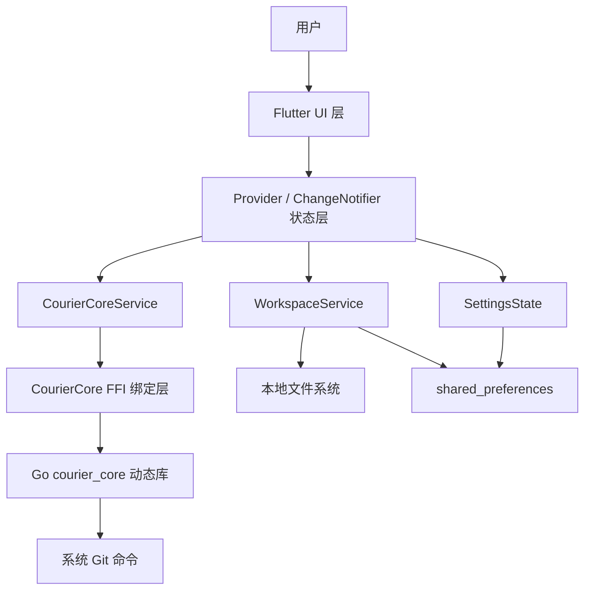

# Courier Flutter 现有系统总结

> [!IMPORTANT]
> 本文是升级实施前的历史基线快照，保留用于追溯原 FFI/DLL 架构与当时的风险判断，不代表当前代码状态。当前实现与运行说明请参阅 [README](../README.md)，当前 Flutter-only 架构与维护上下文请参阅 [PROJECT_CONTEXT](../PROJECT_CONTEXT.md)，升级目标及验收依据请参阅 [升级计划](./升级计划.md)。

## 1. 文档信息

| 项目 | 内容 |
|---|---|
| 文档路径 | `./docs/现有系统总结.md` |
| 适用项目 | `courier_flutter` |
| 文档目的 | 总结当前 Flutter 桌面端项目的结构、架构、核心模块、可识别数据模型、构建状态与风险，为后续升级计划提供依据 |
| 约束 | 本文只描述现状，不要求直接修改任何源代码文件 |

## 2. 项目概述

Courier Flutter 是一个面向 Windows 桌面端的 AI 代码编辑器应用。当前项目处于从 React + Wails 架构迁移到 Flutter 桌面端的过程中。项目采用 Flutter 作为桌面 UI 层，保留 Go 后端核心能力，并通过 `dart:ffi` 调用 Go 编译产物动态库。

当前 Flutter 端已经具备以下能力：

1. 三栏主界面布局：文件树、Markdown 编辑器、右侧 AI 助手与任务队列。
2. Flutter UI 基础组件：玻璃拟态容器、悬浮卡片、自定义标题栏、设置弹窗。
3. 工作区服务：目录选择、文件树扫描、文件读写、多标签页、排除列表与文件类型过滤。
4. FFI 绑定层：封装 Go 动态库导出的 AI、任务、Git、加密等函数。
5. Provider 状态管理：工作区、核心服务、设置状态均通过 `ChangeNotifier` 管理。
6. 基础测试：FFI 服务测试、设置页渲染测试、玻璃组件冒烟测试。

## 3. 技术栈现状

| 分层 | 当前技术 | 当前用途 | 观察结论 |
|---|---|---|---|
| UI 框架 | Flutter | 桌面端界面、窗口、组件渲染 | 已形成可运行 UI 骨架与主要面板 |
| 语言 | Dart | Flutter 业务逻辑与 FFI 绑定 | 代码集中在 `lib/`，结构较清晰 |
| 后端核心 | Go 动态库 | AI、任务、Git、加密核心能力 | Flutter 端依赖外部 DLL，当前路径绑定方式存在生产风险 |
| 跨语言调用 | `dart:ffi`、`package:ffi` | 调用 Go 动态库导出函数 | 内存释放流程已有封装，但缺少空指针与异常信封健壮性设计 |
| 状态管理 | Provider + ChangeNotifier | UI 状态、业务状态、设置状态 | 简单有效，适合当前规模 |
| 路由 | go_router | 目前仅主页路由 | 设置页当前以覆盖弹窗方式实现，未纳入路由表 |
| 文件选择 | file_picker | 打开工作区目录 | 已用于工作区选择 |
| 本地偏好 | shared_preferences | 工作区路径、设置项、过滤项 | 可满足轻量偏好，但不适合复杂工作区配置与敏感数据 |
| 桌面窗口 | window_manager | 自定义标题栏、窗口控制 | 已用于 Windows/Linux/macOS 分支初始化 |
| 测试 | flutter_test | 单元测试与 Widget 测试 | 当前测试偏服务集成和渲染冒烟，缺少文件系统边界测试 |

## 4. 当前项目结构

```text
courier_flutter/
├── lib/
│   ├── main.dart
│   ├── services/
│   │   ├── courier_core.dart
│   │   ├── courier_core_service.dart
│   │   ├── models.dart
│   │   ├── settings_state.dart
│   │   └── workspace_service.dart
│   └── widgets/
│       ├── ai_assistant_panel.dart
│       ├── editor_panel.dart
│       ├── file_tree_panel.dart
│       ├── glass.dart
│       ├── right_panel.dart
│       ├── settings_page.dart
│       └── task_queue_panel.dart
├── test/
│   ├── courier_core_service_test.dart
│   ├── settings_page_test.dart
│   └── widget_test.dart
├── windows/
├── analysis_options.yaml
├── pubspec.yaml
├── pubspec.lock
├── PROJECT_CONTEXT.md
├── README.md
├── _build_err.txt
└── _build_log.txt
```

## 5. 当前系统架构



### 5.1 架构说明

1. `main.dart` 负责应用启动、桌面窗口初始化、核心服务加载、Provider 注入与主页面布局。
2. UI 组件通过 Provider 消费 `WorkspaceService`、`CourierCoreService?`、`SettingsState`。
3. 文件系统能力位于 Flutter 端 `WorkspaceService`，直接使用 `dart:io` 操作本地目录与文件。
4. AI、任务、Git、加密能力通过 `CourierCoreService` 调用 `CourierCore` FFI 绑定层，再由 Go 动态库执行。
5. 设置与部分工作区状态通过 `shared_preferences` 持久化。

## 6. 主要模块与职责

### 6.1 应用入口与布局：`lib/main.dart`

| 责任 | 当前实现 |
|---|---|
| Flutter 初始化 | 调用 `WidgetsFlutterBinding.ensureInitialized()` |
| 桌面窗口初始化 | Windows/Linux/macOS 分支中调用 `window_manager` |
| 核心服务初始化 | 尝试创建 `CourierCoreService` 并调用 `getCoreVersion()` 验证 DLL |
| Provider 注入 | 注入 `WorkspaceService`、nullable `CourierCoreService?`、`SettingsState` |
| 主布局 | 标题栏、左文件树、中编辑器、右功能面板、底部状态栏 |
| 设置入口 | 使用 `_showSettings` 状态控制覆盖式 `SettingsPage` |

### 6.2 FFI 绑定层：`lib/services/courier_core.dart`

| 责任 | 当前实现 |
|---|---|
| 动态库加载 | `DynamicLibrary.open()` 加载 Go 动态库 |
| 函数绑定 | 绑定 19 个导出函数 |
| 输入内存管理 | `toNativeUtf8()` 分配，`malloc.free()` 释放 |
| 返回内存管理 | `toDartString()` 读取后调用 Go 侧 `FreeString()` |
| JSON 信封解析 | 将 Go 返回的 JSON 字符串解析为 `FfiResult` |
| 模块封装 | AI、任务、Git、加密四类方法 |

当前风险：默认动态库路径写死为开发机外部绝对路径，不适合作为生产分发机制。

### 6.3 核心服务层：`lib/services/courier_core_service.dart`

| 责任 | 当前实现 |
|---|---|
| UI 访问后端的唯一入口 | 封装 `CourierCore` 同步调用 |
| 响应式状态 | 维护 `ServiceState`、错误信息、AI 会话、任务列表、Git 状态 |
| AI 消息历史 | Flutter 端本地维护 user / assistant 消息列表 |
| 任务队列快照 | 维护任务列表和队列摘要 |
| 错误处理 | 捕获 `CourierException` 和通用异常，更新状态并重新抛出 |

当前风险：FFI 调用均为同步调用，真实 AI 或 Git 操作耗时后可能阻塞 UI 线程。

### 6.4 工作区与文件系统：`lib/services/workspace_service.dart`

| 责任 | 当前实现 |
|---|---|
| 打开工作区 | 通过文件夹选择器或上次路径恢复 |
| 文件树扫描 | 深度限制 8 层，过滤隐藏文件、排除列表和文件类型 |
| 文件操作 | 创建、重命名、删除、读取、保存、另存为 |
| 多标签编辑 | 维护 `EditorDocument` 列表、当前激活文档、dirty 状态 |
| 持久化 | 使用 `shared_preferences` 保存工作区路径和排除列表 |

当前风险：文件写入不是原子写入，删除目录使用递归删除，缺少工作区边界校验、软链接安全策略与回收站策略。

### 6.5 设置状态：`lib/services/settings_state.dart`

| 设置域 | 当前字段 |
|---|---|
| AI | 温度、最大 Token |
| 编辑器 | 字体大小、自动保存、自动保存延迟 |
| 任务队列 | 最大并发、启动时自动运行队列 |
| 通用/工作区 | 启动时恢复上次工作区、显示隐藏文件 |

当前风险：AI Provider 与模型只在 `SettingsPage` 内直接使用 `shared_preferences` 持久化，未统一纳入 `SettingsState`；敏感凭证无密钥管理方案。

### 6.6 UI 组件层

| 文件 | 当前职责 |
|---|---|
| `file_tree_panel.dart` | 工作区文件树、右键菜单、文件/文件夹创建重命名删除、文件拖拽创建任务、排除与分类过滤 |
| `editor_panel.dart` | 多标签 Markdown 编辑、保存、另存为、自动保存、防抖创建任务 |
| `right_panel.dart` | AI 助手与任务队列 Tab 容器，支持拖入文件创建任务 |
| `ai_assistant_panel.dart` | AI 会话初始化、消息输入、消息列表、选项状态展示 |
| `task_queue_panel.dart` | 任务列表、状态筛选、任务详情、手动创建、启动/暂停队列 |
| `settings_page.dart` | 设置中心覆盖卡片，包含 AI 模型、编辑器、任务队列、通用、关于 |
| `glass.dart` | 玻璃拟态基础组件和交互卡片 |

## 7. 关键接口与入口点

### 7.1 Flutter 入口

| 入口 | 类型 | 作用 |
|---|---|---|
| `main()` | Dart 函数 | 初始化 Flutter、窗口、核心服务和 Provider |
| `CourierApp` | Widget | 应用根组件，配置主题和路由 |
| `MainPage` | Widget | 主界面三栏布局 |

### 7.2 FFI 导出函数分类

| 模块 | 函数范围 | 当前用途 |
|---|---|---|
| 核心 | `GetCoreVersion`、`FreeString` | 版本检查、释放 Go 返回字符串 |
| AI | `AIStartSession`、`AISendMessage`、`AIStopSession`、`AIGetOptions` | AI 会话和选项 |
| 任务 | `CreateTask`、`ListTasks`、`GetTaskDetail`、`DeleteTask`、`GetQueueSummary`、`StartQueue`、`PauseQueue` | 任务与队列管理 |
| Git | `GitStatus`、`GitCommit`、`GitDiff`、`GitBranchList` | Git 状态、提交、差异、分支列表 |
| 加密 | `Encrypt`、`Decrypt` | 文本加解密 |

### 7.3 FFI 返回信封

当前 Go 动态库大部分函数返回 JSON 字符串信封：

```json
{
  "ok": true,
  "data": {}
}
```

失败时：

```json
{
  "ok": false,
  "error": "<ERROR_CODE>: <error-message>"
}
```

`<ERROR_CODE>` 与 `<error-message>` 为示例占位符，运行时由后端返回实际错误码与错误描述。

## 8. 当前可识别的数据模型

### 8.1 FFI 基础模型

| 模型 | 字段 | 说明 |
|---|---|---|
| `VersionInfo` | `major:int`、`minor:int`、`patch:int` | Go 侧按值返回的版本结构体 |
| `FfiResult` | `ok:bool`、`data:dynamic`、`error:String` | Go JSON 信封映射 |
| `CourierException` | `code:String`、`message:String` | FFI 错误统一异常 |

### 8.2 AI 模型

| 模型 | 字段 |
|---|---|
| `AISession` | `sessionId`、`workspacePath`、`providerId`、`modelId`、`messageCount`、`createdAt` |
| `AISendMessageResult` | `sessionId`、`messageCount`、`reply` |
| `AIStopSessionResult` | `sessionId`、`status` |
| `AIProviderOption` | `id`、`displayName`、`models` |
| `AIModelOption` | `id`、`displayName` |
| `AIOptionItem` | `value`、`label` |
| `AIGetOptionsResult` | `providers`、`thinkingLevels`、`modes` |
| `AIMessage` | `role`、`text`、`timestamp` |

### 8.3 任务模型

| 模型 | 字段 |
|---|---|
| `TaskItem` | `id`、`title`、`status`、`markdownContent`、`createdAt`、`updatedAt` |
| `QueueSummary` | `total`、`queued`、`running`、`done`、`failed` |
| `DeleteTaskResult` | `taskId`、`status` |
| `QueueControlResult` | `status` |
| `TaskStatus` | `queued`、`running`、`done`、`failed` |

### 8.4 Git 模型

| 模型 | 字段 |
|---|---|
| `GitStatusFile` | `status`、`path` |
| `GitStatusResult` | `workspacePath`、`files`、`clean` |
| `GitCommitResult` | `output`、`message` |
| `GitDiffResult` | `diff`、`staged` |
| `GitBranchListResult` | `branches` |

### 8.5 工作区模型

| 模型 | 字段 | 说明 |
|---|---|---|
| `FileTreeNode` | `name`、`path`、`relativePath`、`isDir`、`children`、`level` | 文件树节点 |
| `EditorDocument` | `id`、`path`、`relativePath`、`fileName`、`content`、`savedContent`、`untitled`、`external` | 编辑器文档标签 |
| `FileDragPayload` | `name`、`path`、`relativePath` | 文件拖拽创建任务载荷 |

## 9. 当前构建与测试状态

### 9.1 静态分析

最近构建日志显示：`flutter analyze lib` 无问题。

### 9.2 测试

最近构建日志显示：`flutter test` 全部通过，共 54 项测试通过。

### 9.3 Windows Release 构建

当前 Windows Release 构建失败。错误原因集中在 CMake 生成阶段：

```text
add_subdirectory given source "flutter/ephemeral/.plugin_symlinks/screen_retriever_windows/windows" which is not an existing directory.
add_subdirectory given source "flutter/ephemeral/.plugin_symlinks/window_manager/windows" which is not an existing directory.
Unable to generate build files
```

结论：当前代码层面的分析和测试基本可用，但发布构建链路存在插件符号链接或依赖恢复问题，属于高优先级更新项。

## 10. 当前可识别技术债务与风险

| 编号 | 风险 | 严重度 | 影响 |
|---|---|---:|---|
| R01 | Go 动态库默认路径硬编码为开发环境外部绝对路径 | 高 | 应用无法稳定分发，用户环境无法加载核心库 |
| R02 | Windows Release 构建失败 | 高 | 无法产出可交付桌面包 |
| R03 | 文件删除为递归永久删除，缺少回收站/二次安全策略 | 高 | 用户工作区数据可能不可恢复 |
| R04 | 文件写入不是原子写入，自动保存中断可能造成内容损坏 | 高 | 编辑器可靠性不足 |
| R05 | 工作区文件操作缺少路径边界校验与软链接策略 | 高 | 可能越权操作工作区外文件 |
| R06 | FFI 同步调用运行在 UI 线程 | 中高 | 真实 AI/Git/任务执行可能造成界面卡顿 |
| R07 | AI Provider 配置未统一管理，缺少 API Key 安全存储与轮换设计 | 高 | 无法生产级对接第三方模型服务 |
| R08 | Go 侧 AI 与任务执行仍有占位行为 | 高 | 无法完成真实 AI 协作与任务队列闭环 |
| R09 | 加密密钥派生方式不满足生产级密码学要求 | 高 | 敏感数据保护强度不足 |
| R10 | README 仍为 Flutter 默认模板 | 中 | 项目交付与新成员接入信息不足 |
| R11 | 路由配置与上下文文档不一致，设置页未注册为 `/settings` 路由 | 低 | 当前功能可用，但架构约定不统一 |
| R12 | 测试依赖本机外部动态库与外部 Git 工作区 | 中 | CI 环境不可重复，测试稳定性不足 |

## 11. 现状结论

Courier Flutter 当前已经从“纯骨架”推进到“可交互原型 + FFI 服务封装 + 基础测试通过”的阶段。下一步更新不应优先扩展低优先级视觉功能，而应先解决以下生产阻断问题：

1. 修复 Windows Release 构建链路，确保可以稳定产出安装包或可执行目录。
2. 消除动态库绝对路径硬编码，建立核心库随应用分发与环境配置机制。
3. 强化工作区文件操作安全，包括路径边界、原子写入、删除保护、软链接处理。
4. 将真实 AI Provider、密钥管理、流式输出和任务执行器纳入生产级设计。
5. 完善 `.Courier` 工作区配置、可观测日志、CI 测试矩阵与发布流程。
